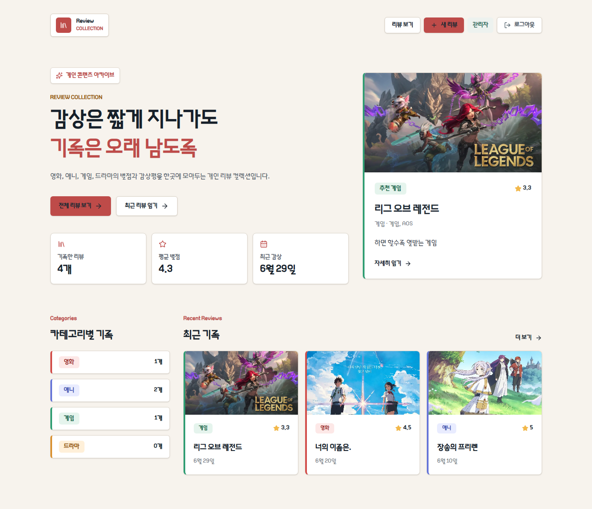

# Review Collection



영화, 애니, 게임, 드라마처럼 오래 기억하고 싶은 콘텐츠를 한곳에 기록하는 개인 리뷰 컬렉션임.

Supabase를 데이터베이스, 인증, 썸네일 저장소로 사용함. Vercel로 배포하고, 로그인한 관리자만 리뷰 작성, 수정, 삭제 가능함.

## 배포 주소

```txt
https://web-project-omega-ruby-60.vercel.app
```

## 주요 기능

- 리뷰 목록과 상세 페이지 제공
- 영화, 애니, 게임, 드라마 카테고리 구분
- 별점, 장르, 감상일, 요약, 감상평 관리
- Supabase Database 기반 리뷰 조회
- Supabase Storage 기반 썸네일 업로드
- Supabase Auth 이메일/비밀번호 로그인
- 로그인한 관리자 전용 리뷰 작성, 수정, 삭제
- 리뷰 삭제 전 확인창 표시
- 카테고리별 기록 수, 평균 별점, 최근 감상일 표시
- Vercel Analytics 기반 방문/페이지뷰 측정
- 로컬 WOFF 폰트 전체 적용
- Supabase RLS 기반 공개 조회와 관리자 쓰기 권한 분리

## 기술 스택

- Next.js 16 App Router
- React 19
- TypeScript
- Tailwind CSS 4
- Supabase Auth
- Supabase Database
- Supabase Storage
- Vercel
- Vercel Analytics
- lucide-react

## 시작하기

의존성 설치.

```bash
npm install
```

개발 서버 실행.

```bash
npm run dev
```

브라우저에서 아래 주소 접속.

```txt
http://localhost:3000
```

프로덕션 빌드 확인.

```bash
npm run build
```

## 환경 변수

`.env.example` 참고해서 `.env.local` 생성 필요.

```txt
NEXT_PUBLIC_SUPABASE_URL=
NEXT_PUBLIC_SUPABASE_PUBLISHABLE_KEY=
```

`NEXT_PUBLIC_SUPABASE_PUBLISHABLE_KEY`는 브라우저에 노출될 수 있는 publishable key임. 실제 데이터 접근 권한은 Supabase RLS 정책으로 제한함.

Vercel 배포 시에도 같은 값을 Project Settings의 Environment Variables에 추가해야 함.

```txt
Vercel > Project Settings > Environment Variables
```

Production 환경에 반드시 추가 필요. Preview, Development에도 같이 넣어두면 편함.

## Supabase 설정

Supabase 프로젝트 생성 후 SQL Editor에서 아래 순서로 실행.

1. `supabase/schema.sql`
2. `supabase/admin-policies.example.sql`
3. `supabase/seed.sql`, 샘플 데이터 필요할 때만

`admin-policies.example.sql` 실행 전 아래 값을 실제 관리자 이메일로 변경 필요.

```sql
'your-email@example.com'
```

## SQL 쿼리 관리

Supabase SQL Editor에는 아래처럼 나눠서 저장 권장.

```txt
Shared
- Setup Review App Schema
```

`supabase/schema.sql` 내용. 리뷰 테이블, 공개 읽기 정책, 썸네일 Storage bucket, 썸네일 공개 읽기 정책 포함.

```txt
Private
- Admin Review Policies
```

`supabase/admin-policies.example.sql`에서 관리자 이메일을 실제 값으로 바꾼 내용. 리뷰 작성, 수정, 삭제와 썸네일 업로드 권한 포함.

```txt
Private, optional
- Seed Sample Reviews
```

`supabase/seed.sql` 내용. 샘플 리뷰가 필요할 때만 실행.

## 관리자 계정

Supabase 대시보드에서 직접 관리자 계정 생성.

```txt
Authentication > Users > Add user > Create new user
```

생성한 계정으로 `/login`에서 로그인하면 관리자 기능 사용 가능.

```txt
/reviews/new
```

새 리뷰 작성.

```txt
/reviews/[id]/edit
```

기존 리뷰 수정.

## 썸네일 업로드

리뷰 작성 또는 수정 화면에서 이미지 파일 업로드 가능. 업로드한 파일은 Supabase Storage의 `review-thumbnails` bucket에 저장됨.

저장 경로 형식.

```txt
review-thumbnails/{reviewId}/{fileName}
```

업로드 후 생성된 public URL이 `reviews.thumbnail` 컬럼에 저장됨. `thumbnail_alt`는 리뷰 제목 기반으로 자동 생성됨.

## 폰트

전체 앱 폰트는 로컬 TTF 파일을 사용함.

```txt
src/assets/fonts/My_Font.ttf
```

`next/font/local`로 로드하고 `--font-main` CSS 변수로 전역 적용함.

## Vercel 배포

GitHub 저장소와 Vercel 프로젝트가 연결되어 있으면 `main` 브랜치 push 시 자동 배포됨.

```txt
main 브랜치 push
→ Vercel build
→ Production 배포
```

Vercel Analytics도 적용되어 있음. 배포 사이트 방문 후 Vercel Analytics 화면에서 페이지뷰 확인 가능.

## 프로젝트 구조

```txt
src/app
Next.js App Router 페이지와 서버 액션

src/app/actions
로그아웃, 리뷰 작성, 수정, 삭제 서버 액션

src/assets/fonts
로컬 폰트와 README 미리보기 이미지

src/components
공통 네비게이션, 리뷰 폼, 삭제 확인 버튼 컴포넌트

src/data
Supabase 리뷰 조회 로직과 Review 타입

src/lib/supabase
Supabase 클라이언트와 세션 갱신 유틸

public/thumbnails
샘플 리뷰에서 사용하는 기본 썸네일

supabase
테이블, 정책, 샘플 데이터 SQL
```

## 배포 전 확인

- `.env.local`은 Git에 올리지 않음
- Vercel Environment Variables에 Supabase URL과 publishable key 추가 필요
- Supabase SQL Editor에서 `schema.sql`과 관리자 정책 적용 필요
- 관리자 정책의 이메일이 실제 로그인 계정과 일치해야 함
- 썸네일 업로드 전 `review-thumbnails` bucket 생성 필요
- `npm run build` 통과 필요
